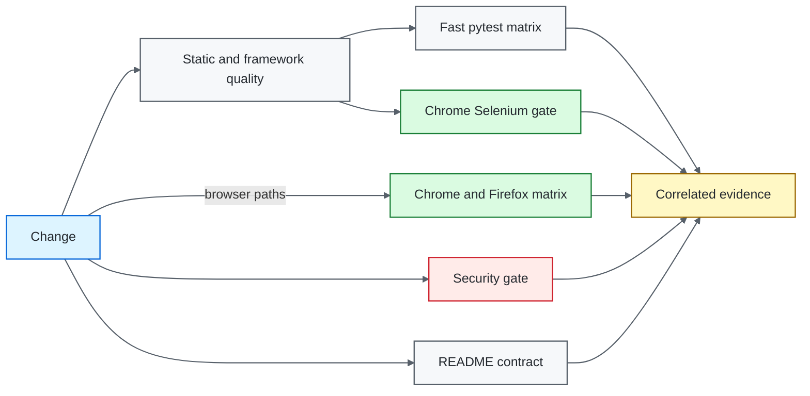
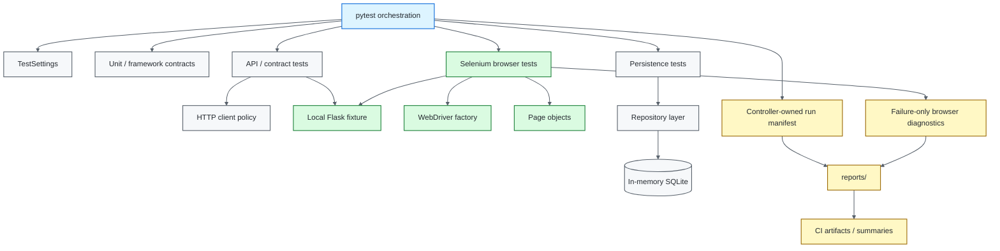

# Python / pytest Quality Engineering Framework

[](https://github.com/portyu9/qa-automation-python-pytest/actions/workflows/ci.yml)
[](https://github.com/portyu9/qa-automation-python-pytest/actions/workflows/extended.yml)
[](https://github.com/portyu9/qa-automation-python-pytest/actions/workflows/security.yml)
[](https://github.com/portyu9/qa-automation-python-pytest/actions/workflows/docs.yml)

[](https://www.python.org/)
[](https://pytest.org/)
[](https://www.selenium.dev/)
[](https://www.sqlalchemy.org/)
[](https://locust.io/)
[](https://www.zaproxy.org/)
[](https://github.com/features/actions)
[](https://trivy.dev/)
[](LICENSE)
[](.github/SECURITY.md)

A layered Python test framework for deterministic unit, API, contract, persistence, browser, security, and performance verification. `pytest` is the orchestration surface. Framework modules own configuration validation, HTTP policy, database lifecycle, Selenium driver lifecycle, explicit browser synchronization, run correlation, and privacy-aware evidence while leaving native tool behavior visible.

> [!IMPORTANT]
> The central design goal is **failure attribution before test volume**. A failed run should make the first broken boundary identifiable: configuration, fixture lifecycle, transport, protocol, persistence, browser behavior, security policy, documentation contract, or external infrastructure.

## Capability map

| Validation plane | What it proves | Default execution policy | Primary evidence |
| --- | --- | --- | --- |
| Fast CI | Unit, API, contract, persistence, framework invariants | Python 3.11 / 3.12 / 3.13 | JUnit, coverage XML, run manifest |
| Browser CI | Critical Chrome workflow behavior | Selenium + Chrome, headless | JUnit, run manifest, bounded failure diagnostics |
| Extended browser | Browser-engine compatibility | Chrome + Firefox | Per-browser JUnit, run manifest, summary |
| Security gate | Dependency and repository-configuration risk | Trivy filesystem scan | JSON findings + Markdown summary |
| Documentation contract | README links, workflow badges, Mermaid roots, governance files, badge palette | Python stdlib validator | Actions status |
| Optional DAST | Dynamic behavior of the repository-local service | OWASP ZAP, loopback target only | Alert classification |
| Performance | Explicit Python workload experiments | Locust, controlled target only | Tool-native latency/throughput/error metrics |
| Observability | Run identity and gate status | Correlated CI artifacts | Run manifests + observability envelopes |

## Gate model



The normal pull-request lane separates quality, functional, browser, security, and documentation failure domains. Cross-browser multiplication is isolated in `extended.yml` so browser compatibility cost does not obscure fast feedback.

## Engineering invariants

| Concern | Framework contract |
| --- | --- |
| Configuration | Parse external values once, validate type/range/URL semantics, expose immutable settings. |
| API targets | Absolute HTTP(S), valid port, no URL credentials, query string, or fragment. |
| UI targets | Independently configurable from API targets; the committed default is a repository-local deterministic fixture. |
| HTTP policy | Connection/read budgets, pooling, run correlation, retries for safe/idempotent methods only. |
| Test isolation | Mutable state belongs to the test or fixture scope that creates it. |
| Persistence lifecycle | The owner that creates an engine/session disposes or closes it deterministically. |
| Browser lifecycle | One WebDriver session per browser test; fixture teardown always quits the driver. |
| Synchronization | Explicit `WebDriverWait` conditions; implicit waits stay disabled; elapsed time is not a readiness condition. |
| Failure evidence | Browser diagnostics are failure-only, bounded, and exclude cookies, storage, page source, URL credentials, query strings, and fragments. |
| Parallelism | xdist workers never race the controller-owned run manifest. |
| Security | Repository scanning is separate from optional loopback-only active DAST. |
| CI integrity | Native command exit codes remain authoritative; reporting steps run without converting failures to success. |
| Documentation | README-local references, workflow badges, Mermaid declarations, governance files, and badge colors are executable contracts. |

## Tool ownership model

The framework adds policy around native tools rather than hiding them behind generic wrappers.

| Tool / technology | Native responsibility | Framework responsibility | Kept visible |
| --- | --- | --- | --- |
| `pytest` | Collection, markers, parametrization, fixtures, phase reporting | Layer markers, fixture lifecycle, run manifest, environment contracts | Node IDs, setup/call/teardown outcomes, native assertion output |
| `requests` | HTTP transport and response objects | Validated target, pooled session, timeout budgets, safe-method retry policy, correlation | HTTP status and transport exceptions |
| SQLAlchemy / SQLite | ORM mapping, transactions, DBAPI lifecycle | Deterministic seeding, repository boundary, explicit engine/session ownership | Transaction behavior and connection lifecycle |
| Selenium WebDriver | Browser process/session, navigation, element interaction | Driver factory, browser selection, explicit waits, failure-evidence policy | WebDriver exceptions and browser-specific behavior |
| Locust | Workload scheduling and performance metrics | Controlled-target ownership and experiment configuration | Native latency, throughput, error, and user metrics |
| OWASP ZAP | Active scanning and alert classification | Hard-bound loopback target and bounded daemon polling | Scanner findings |
| Trivy | Filesystem vulnerability and supported configuration analysis | Severity/fixed-finding gate and retained evidence | Tool-native findings |
| GitHub Actions | Job scheduling, matrices, isolation, artifact transport | Separation of functional, browser, security, docs, and observability domains | Native process exit codes and job status |

## Architecture



Tests state intent. Framework code controls reusable boundaries. HTTP retry behavior does not live in assertions, browser readiness does not live in sleeps, and evidence serialization does not live in parallel workers.

## Repository map

```text
.
├── contract/
│   └── openapi.yaml
├── docs/
│   ├── ARCHITECTURE.md
│   └── TEST_STRATEGY.md
├── mock/
│   ├── data.json
│   └── server.py
├── performance/
│   └── locustfile.py
├── src/
│   ├── api_client.py
│   ├── browser.py
│   ├── config.py
│   ├── db.py
│   ├── http_client.py
│   ├── run_manifest.py
│   ├── pages/
│   └── repositories/
├── tests/
│   ├── api/
│   ├── db/
│   ├── e2e/
│   ├── framework/
│   ├── performance/
│   ├── security/
│   └── unit/
├── .github/
│   ├── scripts/
│   │   └── validate_readme.py
│   └── workflows/
│       ├── ci.yml
│       ├── docs.yml
│       ├── extended.yml
│       └── security.yml
├── conftest.py
├── pytest.ini
├── pyproject.toml
└── requirements.txt
```

## Quick start

Python 3.11+ is covered by the CI compatibility matrix.

```bash
python -m venv .venv
source .venv/bin/activate          # Windows PowerShell: .venv\Scripts\Activate.ps1
python -m pip install --upgrade pip
pip install -r requirements.txt
pytest --ignore=tests/e2e --ignore=tests/performance --ignore=tests/security
```

Run the deterministic Chrome browser layer:

```bash
TEST_BROWSER=chrome pytest tests/e2e
```

Run the Firefox compatibility layer:

```bash
TEST_BROWSER=firefox pytest tests/e2e
```

The `driver` fixture starts the repository-local Flask application, waits for its TCP readiness with a deadline, creates one isolated WebDriver session, and always terminates both browser and service ownership correctly.

<details>
<summary><strong>Operator command reference</strong></summary>

```bash
# Static/source quality
ruff check .
python -m compileall -q src tests

# Documentation contract
python .github/scripts/validate_readme.py

# Parallel framework-lifecycle contract
TEST_REPORT_DIR=reports/xdist-contract \
pytest tests/framework/test_configuration_contract.py \
       tests/framework/test_run_manifest.py \
       -n 2

# Fast functional gate with coverage
pytest \
  --ignore=tests/e2e \
  --ignore=tests/performance \
  --ignore=tests/security \
  --cov=src \
  --cov-report=term-missing

# Browser smoke workflow
TEST_BROWSER=chrome pytest tests/e2e -m smoke

# Optional local-only ZAP integration
pytest tests/security -m security
```

</details>

## Runtime configuration

`src/config.py` is the environment boundary. Invalid settings fail before browser or network side effects.

| Variable | Purpose | Default |
| --- | --- | --- |
| `TEST_BASE_URL` | API target used by framework HTTP clients | `https://jsonplaceholder.typicode.com` |
| `TEST_UI_BASE_URL` | Browser target | `http://127.0.0.1:5000/ui` |
| `TEST_BROWSER` | Selenium browser: `chrome` or `firefox` | `chrome` |
| `TEST_HEADLESS` | Browser headless mode | `true` |
| `TEST_BROWSER_TIMEOUT_SECONDS` | Explicit wait/page/script deadline | `10` |
| `TEST_CONNECT_TIMEOUT_SECONDS` | HTTP TCP/TLS connection budget | `5` |
| `TEST_READ_TIMEOUT_SECONDS` | HTTP response-read budget | `15` |
| `TEST_RETRY_TOTAL` | Safe/idempotent HTTP retry budget | `2` |
| `TEST_RUN_ID` | Cross-layer correlation identifier | generated UUID |
| `TEST_REPORT_DIR` | Run-manifest/evidence directory | `reports` |

API and UI base URLs may contain path prefixes, but URL credentials, query strings, fragments, malformed ports, and invalid schemes are rejected. Authentication belongs in explicit application flows, headers, cookies, or secret-backed configuration rather than URL user-info.

Copy `.env.example` only as a reference for non-secret configuration. Do not commit credentials or generated environment files.

## Selenium browser policy

`src/browser.py` owns driver construction. `conftest.py` owns fixture scope and teardown. `src/pages/` owns feature-oriented browser interactions.

The browser layer follows these rules:

- Selenium Manager may resolve compatible driver binaries; tests do not commit local driver executables.
- Chrome and Firefox are explicit compatibility dimensions rather than hidden defaults.
- implicit waits remain disabled to avoid mixed timeout semantics;
- page objects use `WebDriverWait` with meaningful expected conditions;
- each test receives a fresh WebDriver session;
- browser teardown executes even when assertions fail;
- screenshots are collected only after failed browser calls;
- diagnostic metadata strips URL credentials, query strings, and fragments;
- cookies, local storage, session storage, response bodies, and page source are not collected by the generic framework;
- application-specific evidence that may contain customer data requires a separate documented policy.

> [!WARNING]
> Fixed sleeps are not synchronization. Increasing a global timeout to conceal an unknown readiness condition converts an attributable failure into a slower ambiguous failure.

## Deterministic browser fixture

`mock/server.py` exposes a small local UI under `/ui` and `/ui/details`. The committed browser test exercises navigation and stable `data-testid` contracts against this local application. This keeps framework CI independent of public websites, vendor documentation availability, DNS, and unrelated content changes.

When adopting the framework for an application, set `TEST_UI_BASE_URL` to the intended environment and replace the fixture-specific page objects/tests with domain flows. Keep the same driver, wait, configuration, evidence, and teardown policies.

## Layer selection

A requirement belongs at the lowest layer that can conclusively prove it.

| Requirement | Preferred layer | Reason |
| --- | --- | --- |
| Pure transformation or rule | Unit | Minimal dependency surface |
| HTTP status/body behavior | API | Transport semantics without browser cost |
| Provider response shape | Contract/schema | Version-controlled structural expectation |
| Repository/transaction behavior | Database | Persistence semantics are the subject |
| Rendering/navigation/input behavior | Browser | Requires a browser engine |
| Browser compatibility | Extended browser matrix | Risk is browser-specific |
| Dependency/configuration exposure | Security workflow | Static repository risk |
| Dynamic application security | ZAP local DAST | Controlled active behavior against an approved target |
| Latency/throughput under workload | Locust | Performance semantics require load generation |

Browser tests should not repeat large business-data matrices that are already deterministic at unit or API layers.

## HTTP transport policy

`src/http_client.py` owns cross-cutting HTTP behavior:

- persistent `requests.Session` pooling;
- separate connect/read timeout budgets;
- bounded retries;
- explicitly retryable transient statuses;
- retries limited to safe/idempotent methods;
- `X-Test-Run-Id` correlation;
- deterministic close/context-manager lifecycle.

Assertion retries and mutating-request retries are not a reliability strategy. Repeat execution is valid only when the operation is safe to repeat and the failure is classified as transient.

## Persistence policy

The persistence layer uses SQLAlchemy with in-memory SQLite for deterministic framework tests. The session-scoped fixture creates and seeds the engine; function-scoped sessions are closed after each test; the engine is disposed when its owner exits.

Application adoption should preserve ownership rules even when SQLite is replaced by PostgreSQL, MySQL, SQL Server, or another provider. Tests should be explicit about transaction boundaries, cleanup strategy, test-data ownership, and whether a check is repository-level or infrastructure integration.

## Run correlation and evidence

`src/run_manifest.py` records test outcomes under a run identifier. In xdist execution, workers report native pytest events to the controller and the controller alone writes the run-level manifest. Shared evidence therefore has one writer.

Browser failure evidence uses the same run identifier. The generic collector intentionally favors a small safe envelope over exhaustive diagnostics. More evidence is not automatically better evidence when it can retain credentials, personal data, or application secrets.

## Security model

The repository has two deliberately different security surfaces.

### Repository security gate

`.github/workflows/security.yml` scans the checked-out repository with Trivy and retains machine-readable/summary output. Security findings remain a separate failure domain from functional test failures.

### Optional active DAST

`tests/security/` contains the optional OWASP ZAP integration. Its active-scan target is hard-bound to the loopback fixture; environment variables cannot redirect the committed test toward an arbitrary external system.

For a real application, active scanning should require explicit environment authorization, approved scope, rate limits, authentication handling, and data-retention rules before the loopback restriction is replaced.

## Performance model

`performance/locustfile.py` is a Python-native performance experiment surface. Performance checks answer capacity and service-level questions; they do not substitute for functional assertions. Workload shape, target approval, test duration, concurrency, thresholds, and environment ownership should be explicit before a performance run is treated as a release signal.

## CI design

### `ci.yml`

The main CI workflow runs:

1. source quality and compile checks;
2. an xdist ownership contract for the run manifest;
3. the fast pytest matrix across supported Python versions;
4. a deterministic headless Chrome/Selenium workflow;
5. retained JUnit, coverage, run-manifest, observability, and browser evidence.

### `extended.yml`

The extended workflow runs Chrome and Firefox when browser/framework paths change, on `main`, on schedule, or by manual dispatch. It keeps engine-specific failures independently attributable.

### `security.yml`

Security scanning executes independently from behavior tests and retains its own evidence.

### `docs.yml`

Documentation validation executes a repository-local standard-library validator. It does not make documentation correctness depend on external website uptime.

## Documentation contract

`.github/scripts/validate_readme.py` checks deterministic repository-local facts:

- local Markdown targets resolve inside the repository;
- every displayed workflow badge maps to a committed workflow file;
- Mermaid blocks start with a recognized declaration;
- root `LICENSE` and `.github/SECURITY.md` remain present;
- every static Shields badge uses a unique color within this README;
- the Security Policy badge remains GitHub-dark `#24292F`.

## Application adoption checklist

Before replacing the local fixtures with a system under test:

1. define environment ownership and approved API/UI targets;
2. store credentials in the CI secret store, never in repository files or URL user-info;
3. model authentication as a reusable fixture or domain flow with explicit cleanup;
4. define test-data creation, isolation, and teardown per layer;
5. replace fixture page objects with stable domain-facing abstractions;
6. define the browser compatibility matrix from supported-user risk rather than convenience;
7. classify which failures are retryable infrastructure faults and which are product defects;
8. define evidence retention and redaction rules before collecting application data;
9. keep active security and performance runs behind explicit target-authorization controls;
10. keep fast pull-request gates separate from expensive scheduled or release-level suites.

## Review checklist

A framework change should answer these questions before merge:

- Does the test prove a requirement at the lowest sufficient layer?
- Is external configuration validated before side effects?
- Is every created process/session/engine/driver owned and closed by a clear lifecycle?
- Are waits tied to observable readiness rather than elapsed time?
- Are retries restricted to known transient and safe-to-repeat operations?
- Can parallel execution race on shared files or test data?
- Can diagnostics leak credentials, tokens, customer data, query strings, cookies, or storage?
- Do CI summaries preserve the original command failure?
- Does the README still describe the executable implementation rather than an aspirational design?

## Further reading

- [`docs/ARCHITECTURE.md`](docs/ARCHITECTURE.md) — configuration, transport, persistence, Selenium lifecycle, parallelism, and evidence boundaries.
- [`docs/TEST_STRATEGY.md`](docs/TEST_STRATEGY.md) — layer selection, browser coverage, reliability policy, security, performance, and CI gating.
- [`contract/openapi.yaml`](contract/openapi.yaml) — version-controlled API contract artifact.

The framework should evolve by making failures more attributable, dependencies more explicit, evidence safer, and test intent more readable. New abstraction is justified when it enforces a durable policy or removes a demonstrated source of ambiguity.
