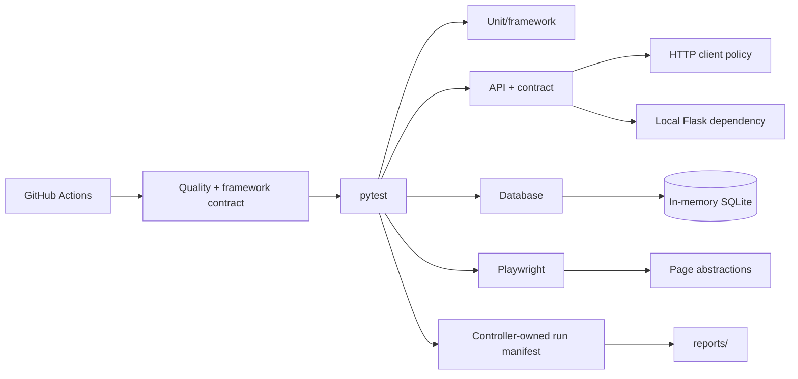
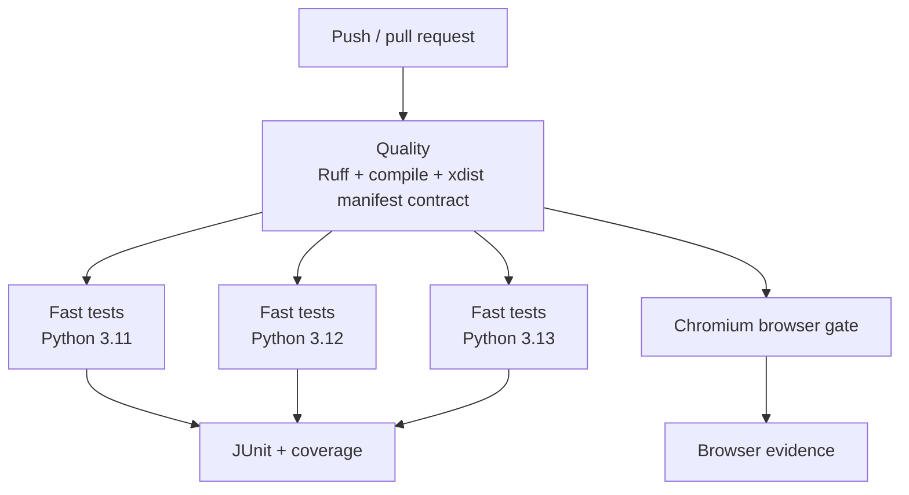

# Python / pytest Automation Framework

A layered Python test framework for unit, API, contract, database, browser, security, and performance verification. pytest remains the orchestration surface; framework code supplies validated runtime configuration, deterministic dependency boundaries, HTTP policy, persistence helpers, browser page abstractions, and privacy-aware run diagnostics without hiding native pytest or Playwright behavior.

## Engineering contract

| Concern | Framework policy |
| --- | --- |
| Configuration | Parse once from environment, validate type/range/URL semantics, expose immutable settings. |
| Base URL | Absolute HTTP(S), valid port, no URL credentials/query/fragment; optional path prefixes allowed. |
| Network calls | Bounded connect/read timeouts, pooling, run correlation, retries only for safe/idempotent methods. |
| Test isolation | Tests own mutable data; in-memory SQLite and a local Flask API provide deterministic fast-layer dependencies. |
| Browser synchronization | Playwright web-first behavior and semantic locators; fixed sleeps are not synchronization. |
| Parallelism | Fast tests assume concurrency; xdist workers do not race the controller-owned run manifest. |
| Diagnostics | JUnit, coverage, browser evidence, and an atomic `reports/run-manifest.json`. |
| Diagnostic privacy | Secret-like runtime keys are redacted; persisted URLs retain only origin/path. |
| CI | Quality + xdist framework contract first, fast tests across Python 3.11/3.12/3.13, separate Chromium gate. |

## Architecture



The design separates **test intent** from **execution policy**. Tests describe behavior. Configuration, retry policy, process readiness, persistence setup, and diagnostic serialization live in framework modules.

## Repository layout

```text
.
├── contract/
│   └── openapi.yaml
├── docs/
│   ├── ARCHITECTURE.md
│   └── TEST_STRATEGY.md
├── mock/
│   ├── data.json
│   └── server.py
├── performance/
│   └── locustfile.py
├── src/
│   ├── config.py
│   ├── http_client.py
│   ├── api_client.py
│   ├── db.py
│   ├── run_manifest.py
│   ├── pages/
│   └── repositories/
├── tests/
│   ├── api/
│   ├── db/
│   ├── e2e/
│   ├── framework/
│   ├── performance/
│   └── security/
├── conftest.py
├── pytest.ini
├── pyproject.toml
└── requirements.txt
```

## Quick start

Python 3.11+ is supported by the CI matrix.

```bash
python -m venv .venv
source .venv/bin/activate          # Windows PowerShell: .venv\Scripts\Activate.ps1
python -m pip install --upgrade pip
pip install -r requirements.txt
python -m playwright install chromium
pytest --ignore=tests/e2e --ignore=tests/performance --ignore=tests/security
```

Run browser tests separately:

```bash
pytest tests/e2e
```

Run framework contracts in parallel, matching the CI ownership check:

```bash
TEST_REPORT_DIR=reports/xdist-contract \
pytest tests/framework/test_configuration_contract.py \
       tests/framework/test_run_manifest.py \
       -n 2
```

Run quality checks:

```bash
ruff check .
python -m compileall -q src tests
```

## Runtime configuration

`src/config.py` converts environment variables into immutable `TestSettings`. Invalid values fail before network/browser behavior begins.

| Variable | Purpose | Default |
| --- | --- | --- |
| `TEST_BASE_URL` | Base HTTP target used by framework clients | `https://jsonplaceholder.typicode.com` |
| `TEST_BROWSER` | `chromium`, `firefox`, or `webkit` | `chromium` |
| `TEST_HEADLESS` | Browser headless mode | `true` |
| `TEST_CONNECT_TIMEOUT_SECONDS` | TCP/TLS connection budget | `5` |
| `TEST_READ_TIMEOUT_SECONDS` | Response read budget | `15` |
| `TEST_RETRY_TOTAL` | Idempotent transport retry budget | `2` |
| `TEST_RUN_ID` | Cross-layer correlation identifier | generated UUID |
| `TEST_REPORT_DIR` | Run-manifest output directory | `reports` |

`TEST_BASE_URL` may include a path prefix but cannot contain URL credentials, a query string, or a fragment. A malformed or out-of-syntax port is rejected during configuration. Authentication belongs in controlled headers/cookies, not URL user-info.

`.env.example` contains non-secret examples only.

## Test layers and ownership

| Layer | Primary question | Dependency strategy | Typical gate |
| --- | --- | --- | --- |
| Unit | Does one function/object behave correctly? | In-process | Every change |
| Framework contract | Do config, diagnostics, repositories, and lifecycle helpers preserve invariants? | Deterministic local | Every change |
| API | Does HTTP behavior satisfy semantic expectations? | Local mock where possible | Every change / integration |
| Contract | Does service shape match versioned expectations? | OpenAPI/schema artifacts | Every change |
| Database | Do persistence/repository semantics hold? | In-memory SQLite | Every change |
| Browser | Does a critical browser workflow function? | Chromium CI; other engines risk-based | Pull request / release |
| Security | Do explicit security assertions hold? | Controlled target only | Scheduled / release |
| Performance | Are agreed budgets preserved? | Authorized environment only | Controlled run |

A test belongs at the **lowest layer that can prove the behavior**. Browser tests should not duplicate deterministic rule matrices that can be covered faster at lower layers.

## HTTP policy

`src/http_client.py` owns transport behavior:

- persistent `requests.Session` pooling;
- separate connect/read timeout budgets;
- bounded retry count;
- retryable transient statuses;
- retries restricted to safe/idempotent methods;
- `X-Test-Run-Id` correlation;
- deterministic close/context-manager lifecycle.

Do not add blanket retries around assertions or mutating operations. Retry is valid only where repeat execution is safe and the failure class is transient.

## Deterministic dependency boundaries

Fast API tests can start the local Flask service through `run_mock_api`. Readiness uses bounded TCP polling rather than a fixed startup sleep. Teardown requests graceful termination and escalates only after the cleanup budget.

Database tests use a session-scoped in-memory SQLite engine and short-lived SQLAlchemy sessions. Tests create the state they assert and do not depend on ordering.

## Browser design

Page modules expose application intent, not generic browser wrappers. Prefer:

- role/label/test-id locators;
- web-first Playwright assertions;
- API/data setup when setup is not the behavior under test;
- unique data for mutable state;
- browser projects selected by compatibility risk.

Avoid `time.sleep()` for UI readiness. A fixed delay slows healthy runs and remains nondeterministic under load.

## Run diagnostics

`conftest.py` registers a small operational pytest plugin. The controller writes:

```text
reports/run-manifest.json
```

The manifest contains:

- schema version and run ID;
- validated non-secret runtime metadata;
- one retained outcome per pytest node ID;
- retained phase (`setup`, `call`, or `teardown`);
- bounded duration;
- worker identity when xdist is active;
- deterministic filesystem-safe artifact key;
- aggregate passed/failed/skipped counts.

When multiple phase reports exist, the most severe outcome is retained so a teardown failure cannot be hidden by an earlier successful call phase.

### xdist ownership

The controller is the only run-manifest writer. xdist workers produce normal test reports and the controller aggregates them. Workers never write the shared run-level file.

CI verifies this with a real two-worker framework-contract run, parses the resulting manifest, confirms it contains outcomes, and confirms no temporary file remains. This tests the multi-process topology rather than merely unit-testing JSON serialization.

### Privacy and atomicity

Diagnostic URLs retain only scheme/host/path. URL credentials, query strings, and fragments are removed before persistence, covering common token-in-query patterns. Secret-like runtime keys are replaced with `<redacted>`.

The manifest is written to a temporary file and atomically renamed so an interrupted process cannot leave partial JSON at the final artifact path.

Screenshots/traces/page content can still contain application-visible values. Use synthetic data and controlled test accounts; structured redaction does not sanitize arbitrary pixels/DOM content.

## CI topology



CI uses read-only repository permissions, concurrency cancellation, dependency caching, bounded artifact retention, explicit Chromium installation, and separate fast/browser failure domains.

## Failure triage

| Failure class | First evidence/action |
| --- | --- |
| Configuration | Correct invalid input; do not rerun as a workaround |
| Ruff/compile | Fix the static/source defect |
| xdist manifest contract | Treat as framework lifecycle/parallelism regression |
| Fast test | pytest node ID + assertion + JUnit + manifest |
| Mock readiness | Process/port lifecycle evidence |
| Browser | Playwright evidence + correlated run ID |
| External timeout | Classify transport/dependency before changing assertions |
| Retry-only pass | Reliability investigation |

A rerun that makes a failure disappear is evidence of nondeterminism, not proof that the test is healthy.

## Extension rules

When adding framework behavior:

- validate external input at one configuration boundary before side effects;
- keep transport policy in the HTTP layer;
- add repository methods around domain persistence operations, not generic SQL wrappers;
- keep page objects feature-oriented and small;
- add reusable fixtures only when their lifecycle truly spans tests/modules;
- add framework-contract tests for infrastructure invariants;
- keep run-level shared artifacts single-writer or explicitly namespaced;
- emit bounded structured diagnostics;
- never persist credentials, authorization, query secrets, or sensitive payloads by default;
- preserve native pytest/Playwright APIs wherever they already express the operation clearly.

## Anti-patterns

The framework intentionally rejects:

- global mutable test state;
- order-dependent tests;
- unconditional assertion retries;
- fixed sleeps as readiness checks;
- credentials/query secrets embedded in base URLs;
- generic wrappers that obscure native pytest/requests/Playwright APIs;
- uncontrolled security/performance activity against public systems;
- diagnostics that dump credentials or full sensitive payloads;
- CI jobs that suppress a failing test command's exit status.

## Further design documentation

- [`docs/ARCHITECTURE.md`](docs/ARCHITECTURE.md) — configuration, transport, lifecycle, parallelism, and evidence boundaries.
- [`docs/TEST_STRATEGY.md`](docs/TEST_STRATEGY.md) — layer selection, xdist contract, reliability, evidence, and gate policy.
- [`contract/openapi.yaml`](contract/openapi.yaml) — version-controlled API contract artifact.

The framework should evolve by making failures **more attributable**, dependencies **more explicit**, diagnostic data **safer**, and test intent **more readable**—not by adding abstraction layers that merely make native operations harder to see.
