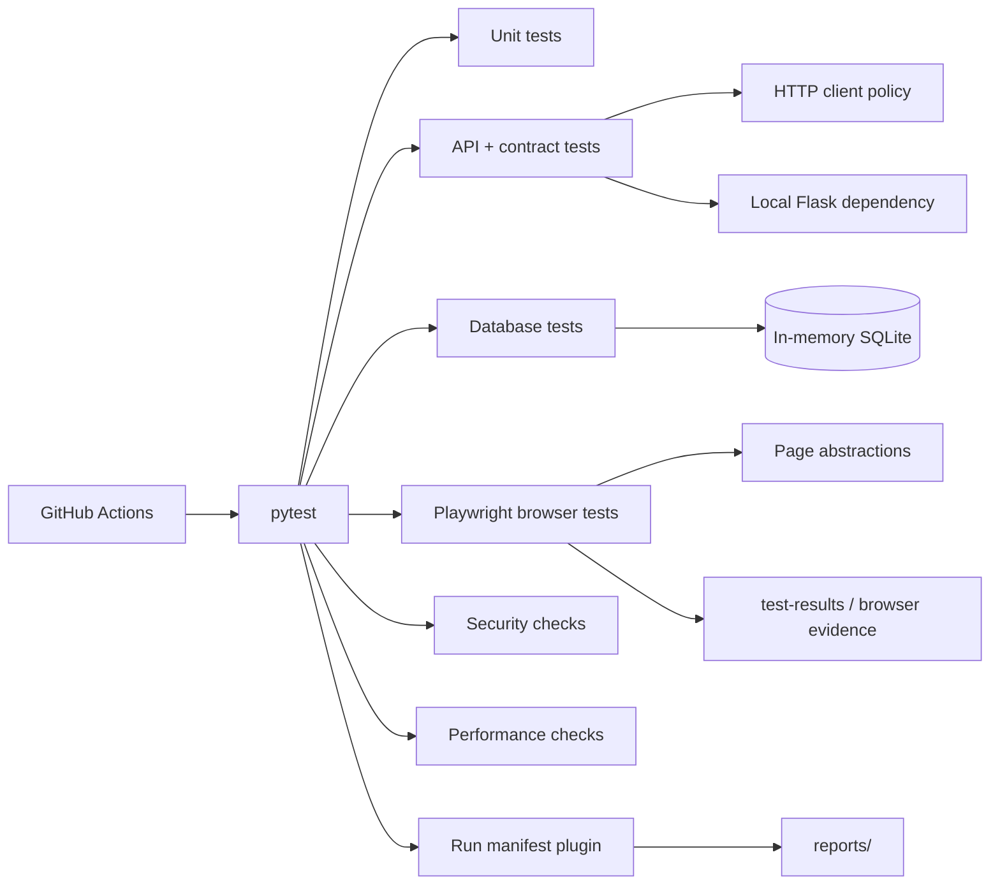
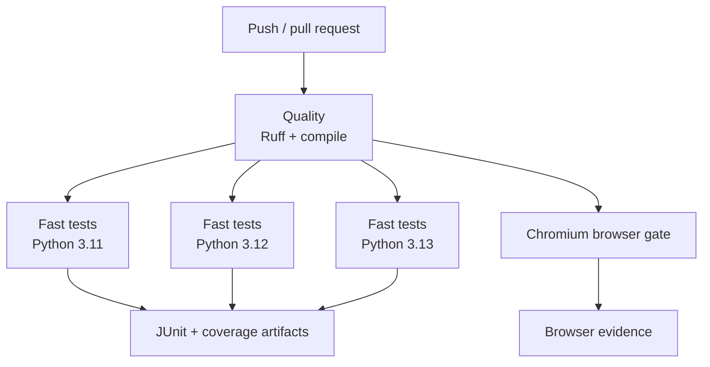

# Python / pytest Automation Framework

A layered Python test framework for unit, API, contract, database, browser, security, and performance verification. pytest remains the orchestration surface; framework code supplies validated runtime configuration, deterministic dependency boundaries, HTTP policy, persistence helpers, browser page abstractions, and run-level diagnostics without hiding native pytest or Playwright behavior.

## Engineering contract

| Concern | Framework policy |
| --- | --- |
| Configuration | Parse once from environment, validate type/range/URL semantics, expose immutable settings. |
| Network calls | Use bounded connect/read timeouts, connection pooling, run correlation, and retries only for safe/idempotent methods. |
| Test isolation | Tests own mutable data; in-memory SQLite and a local Flask API provide deterministic fast-layer dependencies. |
| Browser synchronization | Use Playwright web-first behavior and semantic locators; fixed sleeps are not synchronization. |
| Parallelism | Test data and diagnostics are run-scoped; xdist workers do not race the run-level manifest. |
| Diagnostics | JUnit, coverage, browser evidence, and `reports/run-manifest.json` are machine-readable CI artifacts. |
| Secrets | Runtime metadata is redacted before diagnostic persistence; credentials do not belong in committed environments. |
| CI | Quality checks run first, fast tests execute across supported Python versions, and Chromium is an independent browser gate. |

## Architecture



The framework deliberately separates **test intent** from **infrastructure policy**. Tests should read like behavior specifications. Configuration parsing, retry policy, connection management, process readiness, persistence setup, and diagnostic serialization belong in framework modules.

## Repository layout

```text
.
├── contract/
│   └── openapi.yaml
├── docs/
│   ├── ARCHITECTURE.md
│   └── TEST_STRATEGY.md
├── mock/
│   ├── data.json
│   └── server.py
├── performance/
│   └── locustfile.py
├── src/
│   ├── config.py
│   ├── http_client.py
│   ├── api_client.py
│   ├── db.py
│   ├── run_manifest.py
│   ├── pages/
│   └── repositories/
├── tests/
│   ├── api/
│   ├── db/
│   ├── e2e/
│   ├── framework/
│   ├── performance/
│   └── security/
├── conftest.py
├── pytest.ini
├── pyproject.toml
└── requirements.txt
```

## Quick start

Python 3.11+ is supported by the CI matrix.

```bash
python -m venv .venv
source .venv/bin/activate          # Windows PowerShell: .venv\Scripts\Activate.ps1
python -m pip install --upgrade pip
pip install -r requirements.txt
python -m playwright install chromium
pytest --ignore=tests/e2e --ignore=tests/performance --ignore=tests/security
```

Run the browser layer separately:

```bash
pytest tests/e2e
```

Run quality checks with the same policy used by CI:

```bash
ruff check .
python -m compileall -q src tests
```

## Runtime configuration

`src/config.py` converts environment variables into an immutable `TestSettings` instance. Invalid values fail early instead of surfacing later as ambiguous test failures.

| Variable | Purpose | Default |
| --- | --- | --- |
| `TEST_BASE_URL` | Base HTTP target used by framework clients | `https://jsonplaceholder.typicode.com` |
| `TEST_BROWSER` | Browser engine: `chromium`, `firefox`, or `webkit` | `chromium` |
| `TEST_HEADLESS` | Browser headless mode | `true` |
| `TEST_CONNECT_TIMEOUT_SECONDS` | TCP/TLS connection budget | `5` |
| `TEST_READ_TIMEOUT_SECONDS` | Response read budget | `15` |
| `TEST_RETRY_TOTAL` | Idempotent transport retry budget | `2` |
| `TEST_RUN_ID` | Cross-layer correlation identifier | generated UUID |
| `TEST_REPORT_DIR` | Run-manifest output directory | `reports` |

`.env.example` documents non-secret values only. Environment files are not a credential store.

## Test layers and ownership

| Layer | Primary question | Dependency strategy | Typical gate |
| --- | --- | --- | --- |
| Unit | Does one function/object behave correctly? | In-process only | Every change |
| Framework contract | Do configuration, diagnostics, repositories, and helpers preserve their invariants? | Deterministic local dependencies | Every change |
| API | Does HTTP behavior satisfy semantic expectations? | Local mock for deterministic component cases; explicit external target where intended | Every change / integration |
| Contract | Does the service shape match versioned API expectations? | Version-controlled OpenAPI/schema artifacts | Every change |
| Database | Do repository/persistence semantics hold? | In-memory SQLite | Every change |
| Browser | Does a critical user-visible workflow function in a real browser? | Playwright Chromium CI gate; other engines risk-based | Pull request / release |
| Security | Do explicit security assertions hold? | Controlled target only | Scheduled / release |
| Performance | Does behavior stay within agreed service budgets? | Authorized target only | Controlled environment |

A test belongs at the **lowest layer that can prove the behavior**. Browser tests should not duplicate deterministic business combinations that can be covered faster at unit/API/data layers.

## HTTP policy

`src/http_client.py` owns transport behavior:

- persistent `requests.Session` connection pooling;
- distinct connect and read timeout budgets;
- bounded retry count;
- retryable transient statuses such as 429/5xx;
- retries restricted to safe/idempotent methods;
- `X-Test-Run-Id` correlation;
- context-manager lifecycle.

Do not add blanket retries around assertions or mutating operations. A retry policy is appropriate only when the operation itself is safe to repeat and the failure class is transient.

## Deterministic dependency boundaries

Fast API tests can start the local Flask service through the session-scoped `run_mock_api` fixture. Readiness is established by bounded TCP polling rather than a fixed startup sleep. Teardown first requests normal process termination and escalates only if the child does not exit within the cleanup budget.

Database tests use an in-memory SQLite engine initialized once per session and short-lived SQLAlchemy sessions per test. Tests should create the state they assert and should not depend on ordering.

## Browser design

Page modules expose application intent, not generic browser wrappers. Prefer:

- role/label/test-id locators;
- Playwright assertions that wait for observable state;
- API/data helpers for setup that is not itself under test;
- unique test data for stateful scenarios;
- browser projects selected by risk rather than combinatorial duplication.

Avoid `time.sleep()` for UI synchronization. A fixed delay both slows healthy runs and remains nondeterministic under load.

## Run diagnostics

Every pytest process registers a small operational plugin from `conftest.py`. The controller writes:

```text
reports/run-manifest.json
```

The manifest contains:

- schema version and run identifier;
- validated runtime metadata;
- one final outcome per pytest node ID;
- phase (`setup`, `call`, or `teardown`) associated with the retained outcome;
- bounded duration;
- worker identity when xdist is active;
- deterministic filesystem-safe artifact key;
- aggregate passed/failed/skipped counts.

The controller owns the run-level file, so xdist workers never compete to overwrite it. Secret-like runtime keys are redacted, and URL user information is removed before persistence. The manifest is written through a temporary file and atomically renamed to avoid partial JSON when a process is interrupted.

Example shape:

```json
{
  "schema_version": 1,
  "run_id": "gha-12345-1",
  "summary": {
    "passed": 42,
    "failed": 0,
    "skipped": 1,
    "total": 43
  },
  "outcomes": []
}
```

The manifest complements JUnit and coverage; it does not replace either.

## CI topology



CI uses read-only repository permissions, concurrency cancellation for superseded runs, dependency caching, bounded artifacts, and explicit browser installation. A green browser job is independent of the fast-layer matrix so browser infrastructure failures are easy to classify.

## Failure triage

Start with the narrowest evidence source:

1. **Configuration failure** — invalid environment values fail before test behavior runs.
2. **Quality failure** — inspect Ruff/compile output; do not rerun as a reliability workaround.
3. **Fast test failure** — use pytest node ID, assertion output, JUnit, coverage context, and the run manifest.
4. **Mock dependency failure** — distinguish service readiness/process lifecycle from an assertion failure.
5. **Browser failure** — inspect Playwright evidence and correlate with `TEST_RUN_ID`.
6. **External dependency failure** — verify timeout/retry classification before changing assertions.

A rerun that makes a failure disappear is evidence of nondeterminism, not proof that the test is healthy.

## Extension rules

When adding framework behavior:

- add validation at the configuration boundary rather than scattering environment parsing through tests;
- keep transport policy in the HTTP layer;
- add repository methods around domain persistence operations, not arbitrary SQL helpers;
- keep page objects feature-oriented and small;
- put reusable fixtures in `conftest.py` only when their lifecycle truly spans test modules;
- add framework-contract tests for new infrastructure behavior;
- emit structured diagnostics rather than prose-only logs;
- never write secrets, request authorization, or sensitive payloads into artifacts;
- preserve native pytest/Playwright APIs wherever they already express the operation clearly.

## Anti-patterns

The framework intentionally rejects these patterns:

- global mutable test state;
- order-dependent tests;
- unconditional retries around failed assertions;
- fixed sleeps used as readiness checks;
- implicit environment defaults for credentials;
- generic `click(selector)` / `request(method, path)` abstraction layers that obscure native APIs;
- production-like load against an unapproved public service;
- diagnostics that dump credentials or full sensitive payloads;
- CI jobs that pass while suppressing a failing test command's exit code.

## Further design documentation

- [`docs/ARCHITECTURE.md`](docs/ARCHITECTURE.md) — component boundaries and dependency direction.
- [`docs/TEST_STRATEGY.md`](docs/TEST_STRATEGY.md) — test-layer selection, reliability policy, and release-gate guidance.
- [`contract/openapi.yaml`](contract/openapi.yaml) — version-controlled API contract artifact.

The framework should evolve by making failures **more attributable**, dependencies **more explicit**, and test intent **more readable**—not by adding abstraction layers that merely make the same operations harder to see.
