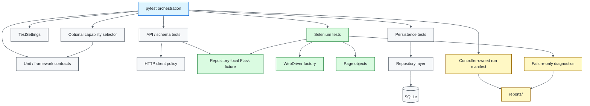

# Python / pytest Quality Engineering Framework

[](https://github.com/portyu9/qa-automation-python-pytest/actions/workflows/ci.yml)
[](https://github.com/portyu9/qa-automation-python-pytest/actions/workflows/extended.yml)
[](https://github.com/portyu9/qa-automation-python-pytest/actions/workflows/security.yml)
[](https://github.com/portyu9/qa-automation-python-pytest/actions/workflows/docs.yml)

[](https://www.python.org/)
[](https://pytest.org/)
[](https://www.selenium.dev/)
[](https://www.sqlalchemy.org/)
[](https://locust.io/)
[](https://www.zaproxy.org/)
[](https://github.com/features/actions)
[](https://trivy.dev/)
[](LICENSE)
[](.github/SECURITY.md)

A layered Python quality-engineering framework for deterministic **unit, API, contract, persistence, browser, security, and performance** verification. `pytest` remains the orchestration surface; framework code exists only where a durable policy needs a single owner: configuration, HTTP transport, database lifecycle, WebDriver construction, synchronization, run correlation, privacy-aware evidence, and optional capability-focused collection.

> [!IMPORTANT]
> The governing principle is **failure attribution before test volume**. A failed run should identify the first broken boundary—configuration, fixture lifecycle, transport, protocol, persistence, browser behavior, security policy, documentation contract, or external infrastructure—without forcing the reader to reverse-engineer the framework.

**Read by intent:** [capabilities](#capability-map) · [architecture](#architecture) · [quick start](#quick-start) · [pytest-native surface](#pytest-native-capability-surface) · [runtime policy](#runtime-configuration) · [browser policy](#selenium-browser-policy) · [CI/evidence](#ci-and-evidence) · [dependency maintenance](#dependency-maintenance) · [failure triage](#failure-triage)

## Capability map

| Validation plane | What it proves | Default execution | Primary evidence |
| --- | --- | --- | --- |
| Fast CI | Unit, API, executable OpenAPI contract, persistence, framework invariants | Python 3.11 / 3.12 / 3.13 | JUnit, coverage XML, run manifest |
| Native pytest surface | Parametrization, fixtures, marks, warnings/exceptions, mocking, asyncio, focused selection | Normal pytest collection | Native node IDs + pytest reports |
| Browser CI | Critical Chrome workflow behavior | Selenium + headless Chrome + local fixture | JUnit, manifest, bounded diagnostics |
| Extended browser | Engine compatibility | Chrome + Firefox | Per-browser JUnit + summaries |
| Security | Dependency and repository-configuration risk | Trivy filesystem scan | JSON findings + Markdown summary |
| Optional DAST | Active behavior of the controlled service | OWASP ZAP, loopback only | Alert classification |
| Performance | Workload policy plus explicit latency/throughput experiments | Locust; bounded loopback script-health smoke in extended CI | Native Locust metrics |
| Documentation | README/workflow/governance consistency | Repository-local validator | Actions status |

## Architecture



The architecture is intentionally asymmetric: tests own **intent**, fixtures own **lifecycle**, framework modules own **cross-cutting policy**, and native tools retain their own failure semantics.

## Engineering invariants

| Concern | Framework contract |
| --- | --- |
| Configuration | Parse external values once; reject unsafe URL/type/range values before side effects. |
| Deterministic targets | Committed API/UI defaults are repository-local; public services are never required for framework health. |
| Pytest ownership | Native parametrization, fixtures, marks, reports, warnings/exceptions, plugins, and node IDs remain visible. |
| Focused execution | `--capability` is opt-in collection filtering; without it, normal full-suite semantics are unchanged. |
| HTTP policy | Pooling, connect/read budgets, correlation, and bounded retries for safe/idempotent methods only. |
| Persistence | The owner that creates an engine/session closes or disposes it deterministically. |
| Browser lifecycle | One WebDriver session per browser test; teardown always quits the driver. |
| Synchronization | Explicit conditions describe readiness; implicit waits and fixed sleeps are not readiness models. |
| Parallelism | Workers do not race the controller-owned run manifest or shared mutable state. |
| Evidence | Automatic diagnostics are bounded, failure-oriented, and avoid credentials/storage/page-source collection. |
| Security | Static repository scanning and active DAST are separate controls with different authorization models. |
| CI integrity | Native command exit codes remain authoritative; reporting cannot turn failure into success. |

## Boundary decision guide

A requirement belongs at the **lowest layer that can conclusively prove it**.

| Question | Preferred boundary | Why |
| --- | --- | --- |
| Pure rule/transformation? | Unit | Lowest dependency and fastest diagnosis |
| HTTP status/body/headers? | API | Proves protocol without browser cost |
| Response structure compatibility? | Contract/schema | Makes structural drift explicit |
| Repository/transaction semantics? | Persistence | Database behavior is the subject |
| Rendering/navigation/input? | Browser | Requires a real browser engine |
| Browser compatibility? | Extended matrix | Compatibility is a distinct risk dimension |
| Dependency/config exposure? | Security workflow | Repository risk, not application behavior |
| Dynamic security behavior? | Authorized DAST | Active scanning needs explicit target control |
| Latency/throughput/capacity? | Locust | Performance requires a workload model |

> [!TIP]
> A browser test is not “more complete” simply because it crosses more layers. It is more expensive and has more failure causes. Use it when browser semantics are material.

## Repository map

```text
.
├── .github/
│   ├── scripts/
│   └── workflows/
├── contract/
├── docs/
├── mock/
├── performance/
├── src/
│   ├── pages/
│   └── repositories/
└── tests/
    ├── api/
    ├── contract/
    ├── db/
    ├── e2e/
    ├── framework/
    ├── performance/
    ├── security/
    └── unit/
```

## Quick start

Python 3.11+ is exercised by CI.

```bash
python -m venv .venv
source .venv/bin/activate          # Windows PowerShell: .venv\Scripts\Activate.ps1
python -m pip install --upgrade pip
pip install -r requirements.txt
pytest --ignore=tests/e2e --ignore=tests/performance --ignore=tests/security
```

Run browser compatibility explicitly:

```bash
TEST_BROWSER=chrome pytest tests/e2e
TEST_BROWSER=firefox pytest tests/e2e
```

Run a focused native-capability slice without changing default collection behavior:

```bash
pytest tests/framework/test_pytest_capabilities.py --capability=fixtures
pytest tests/framework/test_pytest_capabilities.py --capability=asyncio --capability=mocking
```

<details>
<summary><strong>Command reference</strong></summary>

```bash
ruff check .
python -m compileall -q src tests
python .github/scripts/validate_readme.py

pytest --ignore=tests/e2e --ignore=tests/performance --ignore=tests/security \
  --cov=src --cov-report=term-missing

pytest tests/contract
pytest tests/performance
locust -f performance/locustfile.py --headless --host http://127.0.0.1:5000 \
  --users 1 --spawn-rate 1 --run-time 3s --only-summary
pytest tests/framework/test_pytest_capabilities.py --capability=parametrization
TEST_BROWSER=chrome pytest tests/e2e -m smoke
pytest tests/security -m security
```

</details>

## Pytest-native capability surface

`src/pytest_capabilities.py` is a deliberately small extension layer. It adds one repeatable `--capability NAME` option, dynamically registers the strict `capability(name)` marker, applies selection after pytest has built the collection, and reports the active slice in pytest's normal terminal header. It does **not** replace pytest discovery, node IDs, marks, fixture resolution, or reporting.

`tests/framework/test_pytest_capabilities.py` keeps representative first-class pytest behavior executable:

- parameter matrices with stable IDs and `pytest.approx`;
- exception and warning contracts through `pytest.raises` and `pytest.warns`;
- isolated built-in fixtures including `tmp_path`, `monkeypatch`, `capsys`, and `caplog`;
- `pytest-mock` spies that preserve real behavior while asserting calls;
- `pytest-asyncio` native async test execution;
- named capability marks for targeted troubleshooting or teaching without creating a second test-discovery system.

> [!IMPORTANT]
> Capability selection is an **operator convenience**, not a coverage definition. Required CI still runs the intended full gates. A narrow local slice must never be mistaken for proof that unrelated layers are healthy.

## Runtime configuration

`src/config.py` is the environment boundary. Invalid values fail before useful network/browser work.

| Variable | Purpose | Default |
| --- | --- | --- |
| `TEST_BASE_URL` | API target | `http://127.0.0.1:5000` |
| `TEST_UI_BASE_URL` | Browser target | `http://127.0.0.1:5000/ui` |
| `TEST_BROWSER` | `chrome` or `firefox` | `chrome` |
| `TEST_HEADLESS` | Headless browser mode | `true` |
| `TEST_BROWSER_TIMEOUT_SECONDS` | Browser condition budget | `10` |
| `TEST_CONNECT_TIMEOUT_SECONDS` | HTTP connect budget | `5` |
| `TEST_READ_TIMEOUT_SECONDS` | HTTP read budget | `15` |
| `TEST_RETRY_TOTAL` | Safe-method retry budget | `2` |
| `TEST_RUN_ID` | Cross-layer correlation | generated UUID |
| `TEST_REPORT_DIR` | Evidence directory | `reports` |

Base URLs may contain path prefixes but not credentials, query strings, fragments, malformed ports, or unsupported schemes.

## Selenium browser policy

`src/browser.py` owns driver construction; `conftest.py` owns fixture scope/teardown; `src/pages/` owns feature interactions.

- Selenium Manager may resolve compatible local drivers; binaries are not committed.
- Chrome and Firefox are explicit compatibility dimensions.
- implicit waits remain disabled;
- page objects use meaningful `WebDriverWait` conditions;
- each browser test receives a fresh session;
- screenshots are failure-only;
- generic diagnostics exclude cookies, storage, request bodies, page source, and credential-bearing URLs.

> [!WARNING]
> Fixed sleeps convert an unknown readiness condition into a slower unknown readiness condition. Synchronize to observable state instead.

## Deterministic fixture and transport policy

`mock/server.py` owns `/posts`, `/posts/<id>`, `/health`, `/ui`, and `/ui/details`. Required API, OpenAPI contract, browser, and script-health performance gates therefore exercise real local behavior without depending on public DNS, third-party uptime, rate limits, or content drift.

`src/http_client.py` centralizes persistent sessions, separate connect/read budgets, bounded retries, safe-method retry eligibility, `X-Test-Run-Id`, and deterministic close semantics. Assertion retries and blind retries around mutating requests are deliberately excluded.

`contract/openapi.yaml` is executable: the fast contract suite validates the OpenAPI document and validates repository-owned provider responses against its committed response schema. Structural compatibility remains separate from semantic API assertions.

`performance/locustfile.py` defaults to loopback. An external workload requires both `PERF_ALLOW_EXTERNAL=true` and an exact hostname in `PERF_ALLOWED_HOSTS`; changing `--host` alone is insufficient authorization. The extended workflow runs only a bounded single-user loopback smoke to prove workload health. Capacity, saturation, and service-level conclusions require an explicitly designed experiment against an approved environment.

## Persistence policy

SQLAlchemy tests use deterministic SQLite state while retaining explicit session/engine ownership. Replacing SQLite with PostgreSQL/MySQL/SQL Server does not change the lifecycle rule: tests must define transaction ownership, data creation, cleanup, isolation, and whether the requirement is repository semantics or infrastructure integration.

## CI and evidence

- `ci.yml` — source quality, xdist ownership contract, Python compatibility, fast layers including executable OpenAPI contracts, deterministic Chrome.
- `extended.yml` — Chrome/Firefox compatibility plus a bounded loopback Locust script-health smoke on relevant changes, `main`, schedule, and manual dispatch.
- `security.yml` — independent Trivy repository gate.
- `docs.yml` — local-link/badge/Mermaid/governance validation without external-site uptime coupling.

`src/run_manifest.py` gives run-level evidence one writer under xdist: workers emit pytest events, the controller serializes the manifest. Browser evidence uses the same run identity.

## Dependency maintenance

Dependabot is configured for **pip** and **GitHub Actions**.

- version updates run weekly on Monday at 09:00 America/New_York;
- routine minor/patch updates are grouped to reduce review noise;
- major upgrades remain isolated so compatibility changes stay attributable;
- GitHub Actions are maintained as their own dependency surface;
- dependency PRs are not assumed safe because they are automated—CI, security, docs, release notes, and behavioral impact still decide mergeability.

Dependabot version updates complement, rather than replace, vulnerability scanning. Repository security policy and Trivy remain independent controls.

## Failure triage

| Signal | First interpretation |
| --- | --- |
| Capability selection/discovery | Marker/selector contract; confirm intended slice before debugging test logic |
| Configuration contract | Invalid framework/runtime input |
| Local fixture startup | Repository-owned service lifecycle |
| HTTP transport | Connectivity/timeout/retry policy |
| API assertion/schema | Protocol/semantic/contract behavior |
| Persistence | Repository/transaction/lifecycle semantics |
| Driver creation | Browser/runtime infrastructure |
| Explicit-wait timeout | Expected observable browser state absent |
| Browser-only failure | UI behavior or compatibility |
| Retry-only pass | Reliability/flakiness signal |
| Security/docs | Independent repository governance failure |
| External-target-only failure | Environment/integration first |

## Explicit anti-patterns

- required CI against public demo sites or APIs;
- replacing pytest collection/reporting with a custom framework merely to group tests;
- browser setup for behavior that can be proven below the UI;
- fixed sleeps or mixed implicit/explicit waits;
- blanket retries, especially around mutations;
- shared mutable test state or multi-writer evidence files;
- credentials, cookies, storage, page source, or arbitrary payloads in generic diagnostics;
- reports that swallow the original process exit code;
- abstractions that merely rename native pytest/Selenium/requests APIs.

## Design references

- [`docs/ARCHITECTURE.md`](docs/ARCHITECTURE.md) — configuration, transport, persistence, Selenium lifecycle, parallelism, and evidence boundaries.
- [`docs/TEST_STRATEGY.md`](docs/TEST_STRATEGY.md) — layer selection, browser coverage, reliability, security, performance, and CI gates.
- [`contract/openapi.yaml`](contract/openapi.yaml) — version-controlled executable API contract.

The framework should evolve by making **test intent clearer, dependencies more explicit, failures more attributable, and retained evidence safer**. New abstraction is justified only when it enforces a durable engineering policy or removes a demonstrated source of ambiguity.
