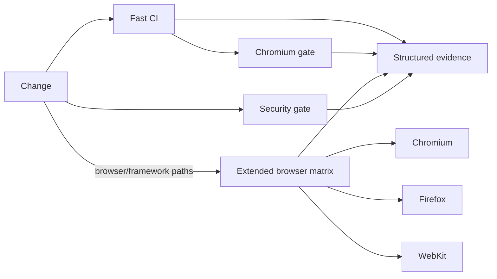
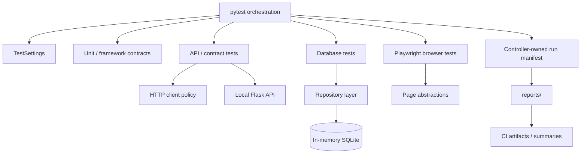
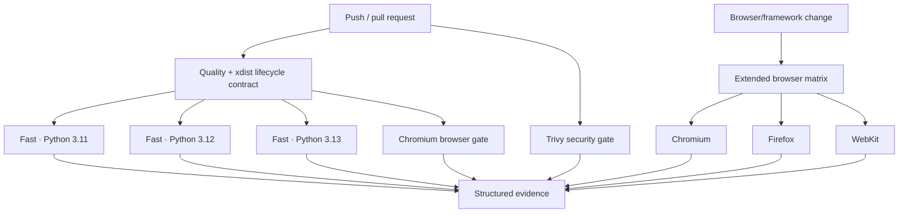

# Python / pytest Quality Engineering Framework

[](https://github.com/portyu9/qa-automation-python-pytest/actions/workflows/ci.yml)
[](https://github.com/portyu9/qa-automation-python-pytest/actions/workflows/extended.yml)
[](https://github.com/portyu9/qa-automation-python-pytest/actions/workflows/security.yml)

A layered Python quality-engineering framework for deterministic unit, API, contract, persistence, browser, security, and performance verification. `pytest` remains the orchestration surface; framework modules own runtime validation, HTTP policy, dependency boundaries, persistence lifecycle, browser abstractions, correlation, and privacy-aware evidence without obscuring native pytest, requests, SQLAlchemy, or Playwright behavior.

> [!IMPORTANT]
> The architecture optimizes for **failure attribution before test volume**. A failed run should identify whether the first broken boundary is configuration, framework lifecycle, transport, protocol, persistence, browser behavior, security policy, or an external environment. Retries and additional abstraction are not substitutes for that classification.

## Capability map

| Validation plane | What it proves | Execution policy | Primary evidence |
| --- | --- | --- | --- |
| Fast CI | Unit, API, contract, database, framework invariants | Python 3.11 / 3.12 / 3.13 | JUnit, coverage XML, run manifest |
| Browser CI | Critical Chromium behavior | Python 3.12 + native pytest-playwright | JUnit, run manifest, Playwright evidence |
| Extended browser | Engine compatibility | Chromium + Firefox + WebKit | Per-engine JUnit, run manifest, summary |
| Security gate | Dependency and repository-configuration risk | Trivy filesystem scan | JSON findings + Markdown summary |
| Optional DAST | Dynamic behavior of the local mock API | OWASP ZAP, loopback target only | pytest assertion + ZAP alert classification |
| Performance | Explicit performance experiments | Locust / controlled target only | Tool-native metrics |
| Observability | Run identity and gate status | Correlated CI + structured artifacts | `ci-observability*.json`, run manifests, Actions summary |

### Gate model



The standard PR lane stays fast. Cross-browser multiplication is isolated in `extended.yml`, triggered by browser/framework changes, `main`, schedule, or manual dispatch. Security scanning is a separate failure domain so dependency/configuration risk is not confused with behavioral test failures.

## Engineering invariants

| Concern | Framework contract |
| --- | --- |
| Configuration | Parse external values once, validate type/range/URL semantics, expose immutable settings. |
| Base URLs | Absolute HTTP(S), valid port, no URL credentials, query string, or fragment. |
| HTTP policy | Connection/read budgets, pooling, correlation, and retries for safe/idempotent methods only. |
| Isolation | Tests own mutable state; local Flask and in-memory SQLite provide deterministic fast boundaries. |
| Browser synchronization | Playwright actionability + web-first assertions; elapsed time is not a readiness condition. |
| Parallelism | Fast tests are concurrency-safe; xdist workers never race the controller-owned run manifest. |
| Evidence | Machine-readable reports are bounded, atomic where shared, and scrub URL user-info/query/fragment. |
| Security | Automated dependency/configuration scanning plus a loopback-only optional active DAST hook. |
| CI integrity | Test exit codes remain authoritative; reporting steps run `always()` without converting failures to success. |

## Architecture



The dependency direction is deliberate: tests state intent; framework code controls boundaries. HTTP retry behavior does not live in assertions, browser readiness does not live in sleeps, and shared diagnostic serialization does not live in xdist workers.

## Repository map

```text
.
├── contract/
│   └── openapi.yaml
├── docs/
│   ├── ARCHITECTURE.md
│   └── TEST_STRATEGY.md
├── mock/
│   ├── data.json
│   └── server.py
├── performance/
│   └── locustfile.py
├── src/
│   ├── config.py
│   ├── http_client.py
│   ├── api_client.py
│   ├── db.py
│   ├── run_manifest.py
│   ├── pages/
│   └── repositories/
├── tests/
│   ├── api/
│   ├── db/
│   ├── e2e/
│   ├── framework/
│   ├── performance/
│   └── security/
├── .github/workflows/
│   ├── ci.yml
│   ├── extended.yml
│   └── security.yml
├── conftest.py
├── pytest.ini
├── pyproject.toml
└── requirements.txt
```

## Quick start

Python 3.11+ is supported by the CI compatibility matrix.

```bash
python -m venv .venv
source .venv/bin/activate          # Windows PowerShell: .venv\Scripts\Activate.ps1
python -m pip install --upgrade pip
pip install -r requirements.txt
python -m playwright install chromium
pytest --ignore=tests/e2e --ignore=tests/performance --ignore=tests/security
```

Run the browser layer:

```bash
pytest tests/e2e --browser=chromium
```

Run a different Playwright engine explicitly:

```bash
python -m playwright install firefox
TEST_BROWSER=firefox pytest tests/e2e --browser=firefox
```

> [!NOTE]
> `TEST_BROWSER` is framework metadata/configuration; pytest-playwright engine selection is performed with its native `--browser` option. Extended CI sets both to the same value so execution behavior and diagnostic metadata cannot disagree.

<details>
<summary><strong>Operator command reference</strong></summary>

```bash
# Static/source quality
ruff check .
python -m compileall -q src tests

# Parallel framework-lifecycle contract
TEST_REPORT_DIR=reports/xdist-contract \
pytest tests/framework/test_configuration_contract.py \
       tests/framework/test_run_manifest.py \
       -n 2

# Fast functional gate with coverage
pytest \
  --ignore=tests/e2e \
  --ignore=tests/performance \
  --ignore=tests/security \
  --cov=src \
  --cov-report=term-missing

# Optional local-only ZAP integration
pytest tests/security -m security
```

The ZAP test skips when the Python ZAP client or daemon is unavailable. When enabled, its active-scan target is hard-bound to `127.0.0.1:5000`; environment variables cannot redirect it toward an external system.

</details>

## Runtime configuration

`src/config.py` is the runtime boundary. Invalid values fail before network or browser side effects.

| Variable | Purpose | Default |
| --- | --- | --- |
| `TEST_BASE_URL` | Base HTTP target used by framework clients | `https://jsonplaceholder.typicode.com` |
| `TEST_BROWSER` | Framework browser identity: `chromium`, `firefox`, `webkit` | `chromium` |
| `TEST_HEADLESS` | Browser headless mode | `true` |
| `TEST_CONNECT_TIMEOUT_SECONDS` | TCP/TLS connection budget | `5` |
| `TEST_READ_TIMEOUT_SECONDS` | Response-read budget | `15` |
| `TEST_RETRY_TOTAL` | Idempotent transport retry budget | `2` |
| `TEST_RUN_ID` | Cross-layer correlation identifier | generated UUID |
| `TEST_REPORT_DIR` | Run-manifest directory | `reports` |

`TEST_BASE_URL` may contain a path prefix, but credentials, query strings, fragments, malformed ports, and out-of-range ports are rejected before use. Authentication belongs in explicit headers/cookies or application flows, not URL user-info.

## Layer selection

A test belongs at the **lowest layer that can conclusively prove the requirement**.

| Requirement | Preferred layer | Reason |
| --- | --- | --- |
| Pure transformation / rule | Unit | Minimal dependency surface |
| HTTP status/body semantics | API | Transport visible without browser cost |
| Provider shape | Contract / schema | Version-controlled structural expectation |
| Repository/transaction behavior | Database | Persistence semantics are the subject |
| Rendering/navigation/input behavior | Browser | Requires a browser engine |
| Engine compatibility | Extended browser matrix | Risk is browser-specific |
| Dependency/configuration exposure | Security workflow | Static repository risk, not runtime behavior |
| Dynamic application security | ZAP local DAST | Controlled active behavior against local fixture only |

Browser tests should not reproduce large business-data matrices that are already deterministic at API/unit layers.

## HTTP transport policy

`src/http_client.py` owns cross-cutting HTTP semantics:

- persistent `requests.Session` pooling;
- separate connect/read timeout budgets;
- bounded retries;
- explicitly retryable transient statuses;
- retries restricted to safe/idempotent methods;
- `X-Test-Run-Id` correlation;
- deterministic close/context-manager lifecycle.

> [!WARNING]
> Assertion retries and mutating-request retries are not a reliability strategy. Repeat execution is valid only when the operation is safe to repeat and the failure is classified as transient.

## Deterministic dependency boundaries

Fast API tests start the local Flask service through `run_mock_api`. Readiness is TCP-polled against a monotonic deadline rather than guessed with a startup sleep. Teardown attempts graceful termination and escalates only after a bounded cleanup budget.

Database tests use a session-scoped in-memory SQLite engine and short-lived SQLAlchemy sessions. Tests create the state they assert; ordering is never a dependency contract.

## Browser model

Page abstractions expose application intent and stable state, not generic wrappers around Playwright. Prefer role/label/test-id locators and web-first assertions.

```python
page.get_by_role("heading", name="Example Domain").wait_for()
```

Avoid fixed readiness delays:

```python
time.sleep(3)  # does not prove the required state exists
```

### Cross-browser expansion

`extended.yml` executes the E2E contract under Chromium, Firefox, and WebKit. Each matrix cell installs only its required engine, receives a run ID suffixed with the engine name, writes an engine-specific JUnit/run-manifest directory, and uploads independent evidence.

This matrix exists to detect engine-specific rendering, navigation, input, standards, and compatibility behavior. It is not a reason to multiply every business-data case three times.

## Security engineering

### Repository security gate

`.github/workflows/security.yml` uses the open-source Trivy filesystem scanner. The action is pinned to an immutable commit corresponding to `v0.36.0`; the scanner engine is explicitly set to `v0.74.0`.

The gate scans:

- dependency manifests and lock-compatible package metadata;
- supported repository/configuration misconfigurations;
- fixed HIGH/CRITICAL vulnerability findings;
- HIGH/CRITICAL supported configuration findings.

`ignore-unfixed: true` keeps the blocking policy focused on findings for which remediation is available. The job preserves `reports/security/trivy.json` and a compact `summary.md` for triage.

### Optional dynamic scan

`tests/security/test_security.py` integrates with OWASP ZAP when a local daemon is available. The scan lifecycle uses bounded polling and the active target is hard-coded to the local mock API. This prevents a test environment variable from turning an ordinary test invocation into active scanning of an unrelated host.

## Test observability

Observability is implemented as **correlation + structured evidence**, not as a required SaaS dependency.

### Correlation hierarchy

```text
GitHub Actions run
└── TEST_RUN_ID
    ├── pytest node IDs
    ├── xdist worker identity
    ├── HTTP X-Test-Run-Id
    └── browser / report artifacts
```

### Run manifest

The controller writes `reports/run-manifest.json` with:

- schema version and run ID;
- validated non-sensitive runtime metadata;
- one retained outcome per pytest node ID;
- final retained phase (`setup`, `call`, `teardown`);
- bounded duration;
- worker identity;
- deterministic artifact key;
- aggregate pass/fail/skip totals.

When multiple phase reports exist, the most severe outcome wins so teardown/setup failures are not hidden by a previously successful call phase.

### CI observability envelope

Primary CI jobs also emit small `reports/ci-observability*.json` files containing run ID, runtime dimension, final job status, commit SHA, and ref. The Actions step summary links the human interpretation to the same run ID. These files are deliberately simple enough to ingest later with open-source log/telemetry tooling without coupling the tests to an external backend.

### Privacy and atomicity

URL diagnostics retain scheme/host/path and remove user-info, query strings, and fragments. Secret-like runtime keys are redacted in the run manifest. Shared manifest writes use temporary files followed by atomic replacement.

Screenshots, traces, DOM/page source, and application payloads may still contain visible synthetic data. Structured redaction is not a substitute for safe test accounts and data minimization.

<details>
<summary><strong>Evidence tree</strong></summary>

```text
reports/
├── run-manifest.json
├── junit-<python>.xml
├── coverage-<python>.xml
├── ci-observability-python-<python>.json
├── ci-observability-browser.json
└── security/
    ├── trivy.json
    └── summary.md

test-results/ / playwright-report/
└── browser-native evidence when produced
```

</details>

## CI topology



## Failure triage

| Signal | First classification | Correct first move |
| --- | --- | --- |
| Configuration exception | Input contract | Correct the invalid value; do not rerun it away |
| Ruff / compile failure | Source quality | Fix source/static defect |
| xdist manifest contract | Framework lifecycle | Inspect controller/worker ownership |
| API assertion | Protocol/semantic behavior | Use node ID + local dependency evidence |
| Mock readiness | Process lifecycle | Inspect listener startup/port ownership |
| Database assertion | Persistence semantics | Inspect test-owned state/transaction boundary |
| Chromium-only failure | Browser/application | Inspect Playwright evidence |
| One extended engine fails | Engine compatibility | Compare browser-specific behavior before weakening assertions |
| Trivy gate | Dependency/configuration risk | Triage exact JSON finding and remediation |
| ZAP finding | Dynamic security behavior | Reproduce only against local controlled target |
| Retry-only pass | Nondeterminism | Investigate state, timing, environment saturation |

## Extension rules

When extending the framework:

1. validate new external inputs before side effects;
2. keep HTTP transport policy in the HTTP layer;
3. keep repository methods domain-oriented rather than building a generic SQL façade;
4. keep page objects feature-oriented and preserve native Playwright primitives;
5. add reusable fixtures only when lifecycle ownership truly spans tests/modules;
6. add framework-contract tests for infrastructure invariants;
7. keep shared artifacts single-writer or explicitly namespaced;
8. emit bounded, privacy-aware diagnostics;
9. add browser multiplication only for browser risk;
10. keep active security/performance behavior constrained to controlled targets.

## Explicit anti-patterns

The framework rejects:

- global mutable business/test state;
- order-dependent tests;
- `time.sleep()` as readiness;
- blanket assertion retries;
- credentials or query secrets in base URLs;
- generic wrappers that make pytest/requests/Playwright harder to debug;
- xdist workers writing one shared artifact;
- unbounded diagnostic payloads;
- active security or sustained performance activity against arbitrary targets;
- CI reporting that suppresses the real test process exit code.

## Design references

- [`docs/ARCHITECTURE.md`](docs/ARCHITECTURE.md) — configuration, transport, persistence, browser, parallelism, and evidence boundaries.
- [`docs/TEST_STRATEGY.md`](docs/TEST_STRATEGY.md) — layer selection, reliability, browser coverage, and gate policy.
- [`contract/openapi.yaml`](contract/openapi.yaml) — version-controlled API contract artifact.

> [!TIP]
> The framework should evolve by making failures **more attributable**, dependencies **more explicit**, evidence **safer**, and test intent **more readable**. A new abstraction is justified only when it enforces a durable policy or removes a demonstrated source of ambiguity.
