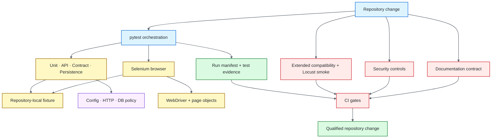

# Python / pytest Quality Engineering Framework

[](https://github.com/portyu9/qa-automation-python-pytest/actions/workflows/ci.yml)
[](https://github.com/portyu9/qa-automation-python-pytest/actions/workflows/extended.yml)
[](https://github.com/portyu9/qa-automation-python-pytest/actions/workflows/security.yml)
[](https://github.com/portyu9/qa-automation-python-pytest/actions/workflows/docs.yml)

[](https://www.python.org/)
[](https://pytest.org/)
[](https://www.selenium.dev/)
[](https://www.sqlalchemy.org/)
[](https://locust.io/)
[](https://www.zaproxy.org/)
[](https://github.com/features/actions)
[](https://trivy.dev/)
[](LICENSE)
[](.github/SECURITY.md)

A layered Python quality-engineering framework for deterministic **unit, API, contract, persistence, browser, security, and performance** verification. `pytest` remains the orchestration surface; reusable framework code exists only where a durable policy needs one owner.

> [!IMPORTANT]
> The governing principle is **failure attribution before test volume**: a failed run should identify the first broken boundary without forcing the reader to reverse-engineer the framework.

**Start here:** [capabilities](#capabilities) · [architecture](#architecture) · [quick start](#quick-start) · [repository map](#repository-map) · [documentation](#documentation)

## Capabilities

| Validation plane | Purpose | Primary evidence |
| --- | --- | --- |
| Fast CI | Unit, API, OpenAPI contract, persistence, framework invariants | JUnit, coverage XML, run manifest |
| Native pytest | Parametrization, fixtures, marks, warnings/exceptions, mocking, asyncio, focused selection | Native node IDs and pytest reports |
| Browser | Critical Chrome behavior with Chrome/Firefox compatibility in extended CI | Per-browser JUnit and bounded diagnostics |
| Security | Supply-chain policy, SAST, dependency/configuration/secret risk, optional controlled DAST | CodeQL, Trivy, Dependency Review, ZAP evidence |
| Performance | Workload-policy verification and explicit latency/throughput experiments | Locust metrics |
| Documentation | README, workflow, Mermaid, link, and governance consistency | Documentation contract status |

## Architecture



Tests own **intent**, fixtures own **lifecycle**, framework modules own **cross-cutting policy**, and native tools retain their failure semantics. See [`docs/ARCHITECTURE.md`](docs/ARCHITECTURE.md) for dependency direction, lifecycle ownership, parallelism, and evidence boundaries.

## Quick start

Choose the interpreter-specific lock matching the active supported Python runtime:

```bash
python -m venv .venv
source .venv/bin/activate          # Windows PowerShell: .venv\Scripts\Activate.ps1
python -m pip install --require-hashes -r requirements-lock/<matching-runtime>.txt
pytest --ignore=tests/e2e --ignore=tests/performance --ignore=tests/security
```

Run browser compatibility explicitly:

```bash
TEST_BROWSER=chrome pytest tests/e2e
TEST_BROWSER=firefox pytest tests/e2e
```

Run a focused native pytest capability without changing normal collection semantics:

```bash
pytest tests/framework/test_pytest_capabilities.py --capability=fixtures
```

For the complete command reference, runtime variables, dependency workflow, performance authorization, and failure triage, see [`docs/OPERATIONS.md`](docs/OPERATIONS.md).

## Repository map

```text
.
├── .github/
├── contract/
├── docs/
├── mock/
├── performance/
├── requirements-lock/
├── src/
└── tests/
```

## Engineering contracts

- **Deterministic targets:** committed framework-health gates use repository-local services rather than public demo dependencies.
- **Lowest conclusive layer:** prove requirements at unit/API/contract/persistence level before paying browser cost.
- **Native pytest semantics:** discovery, node IDs, fixtures, markers, reports, warnings, and plugin behavior remain visible.
- **Explicit lifecycle ownership:** the scope that creates a driver, engine, session, process, or evidence file owns deterministic cleanup.
- **Bounded retries and waits:** retry only known transient safe operations; synchronize browsers to observable state rather than fixed sleeps.
- **Privacy-aware evidence:** generic diagnostics are failure-oriented and exclude credential-bearing or unnecessary application data.
- **Authoritative exits:** reporting and artifact collection never convert a native test/tool failure into success.

## Quality gates

| Gate | Responsibility |
| --- | --- |
| [`ci.yml`](.github/workflows/ci.yml) | Supported-runtime fast suites, executable OpenAPI contracts, source quality, evidence validation, Chrome smoke |
| [`extended.yml`](.github/workflows/extended.yml) | Chrome/Firefox compatibility and bounded loopback Locust script-health smoke |
| [`security.yml`](.github/workflows/security.yml) | Supply-chain policy, CodeQL, Trivy, and Dependency Review when available |
| [`docs.yml`](.github/workflows/docs.yml) | README/local-link/badge/Mermaid/governance consistency |

A green gate is evidence about its defined risk boundary, not a universal claim of system quality. The detailed confidence limits are documented in [`docs/OPERATIONS.md`](docs/OPERATIONS.md#confidence-boundaries).

## Documentation

| Guide | Use it for |
| --- | --- |
| [`docs/ARCHITECTURE.md`](docs/ARCHITECTURE.md) | Dependency direction, configuration/HTTP/DB/browser boundaries, fixture ownership, parallelism, evidence, extension rules |
| [`docs/TEST_STRATEGY.md`](docs/TEST_STRATEGY.md) | Layer selection, browser strategy, selectors, retries, test data, security, performance, CI gating |
| [`docs/OPERATIONS.md`](docs/OPERATIONS.md) | Commands, runtime configuration, deterministic fixture/transport policy, CI evidence, dependency maintenance, triage |
| [`contract/openapi.yaml`](contract/openapi.yaml) | Version-controlled executable API contract |

The deeper flow and CI diagrams live in `/docs`; the main README intentionally retains only the architecture overview above.

## Design principle

The framework should evolve by making **test intent clearer, dependencies more explicit, failures more attributable, and retained evidence safer**. Add abstraction only when it enforces a durable engineering policy or removes a demonstrated source of ambiguity.
