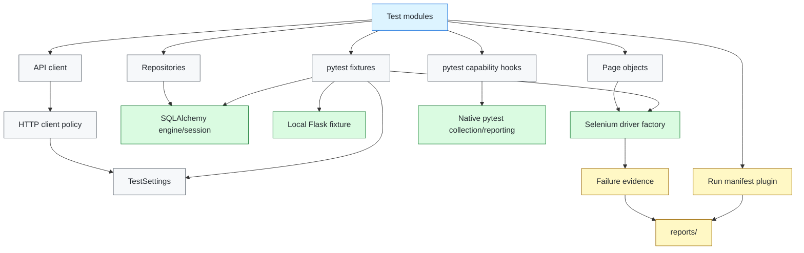
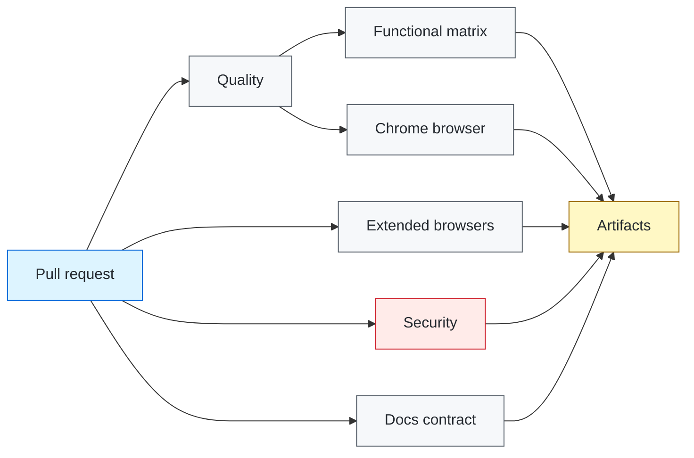

# Architecture

## Purpose

This repository separates test intent from reusable execution policy. `pytest` remains the orchestration engine; framework modules own boundaries that should behave consistently across suites: configuration, HTTP transport, persistence lifecycle, Selenium driver creation, synchronization, diagnostics, run correlation, and focused capability selection.

The architecture favors explicit ownership over generic abstraction. A wrapper is useful only when it enforces a durable contract or centralizes behavior that would otherwise drift between tests.

## Dependency direction

Tests may depend on framework policy. Framework policy must not depend on individual test cases.

## Configuration boundary

`src/config.py` parses environment values into immutable `TestSettings`. Validation happens before network, database, or browser side effects.

The configuration boundary enforces:

- absolute HTTP(S) API and UI URLs;
- valid host and explicit-port semantics;
- rejection of URL user-info, query strings, and fragments;
- finite positive connect/read/browser timeout budgets;
- non-negative retry budgets;
- explicit Chrome/Firefox browser selection;
- strict boolean parsing;
- generated run identity when CI does not provide one;
- supplied run identities limited to 1–128 ASCII letters, digits, dots, underscores, colons, or hyphens.

Rejecting `NaN`, infinities, malformed ports, and unsafe correlation tokens at the settings boundary prevents values that parse successfully but cannot behave safely as deadlines, URLs, artifact keys, or headers from reaching execution layers.

API and UI targets are separate because they frequently have different routing, authentication, and environment ownership. A browser test should never inherit an API base URL accidentally.

## Pytest extension boundary

`src/pytest_capabilities.py` adds focused execution without replacing pytest collection, node IDs, markers, reports, or plugin behavior.

The extension contract is deliberately small:

- `--capability NAME` is repeatable;
- `capability(name)` is registered dynamically so strict-marker mode remains authoritative;
- filtering happens after native collection by marking nonselected tests skipped rather than constructing a second collection model;
- a supplied capability name must exist in the collected suite;
- unknown capability names raise `pytest.UsageError` instead of producing an all-skipped successful run;
- the normal terminal header records the active focused selection.

Focused capability execution is an operator convenience. It does not redefine required CI coverage or permit an unknown selector to create false-green evidence.

## HTTP boundary

`src/http_client.py` owns reusable request behavior:

- persistent connection pooling;
- separate connection and response-read deadlines;
- bounded retries for explicitly safe/idempotent methods;
- transient-status policy;
- run correlation;
- deterministic session close behavior.

Assertions remain in tests. The transport layer does not translate application failures into success or retry mutating operations indiscriminately.

## Persistence boundary

`src/db.py` provides deterministic persistence infrastructure for framework tests. Ownership follows a simple rule: the scope that creates a resource closes it.

- session-scoped fixture: creates and seeds the SQLite engine;
- function-scoped fixture: creates and closes a SQLAlchemy session;
- session teardown: disposes the engine.

Replacing SQLite with an application database should preserve explicit transaction, cleanup, and connection ownership.

## Selenium boundary

`src/browser.py` constructs native Selenium WebDriver sessions. `conftest.py` owns their pytest lifecycle. `src/pages/` contains feature-oriented interaction models.

### Driver factory

The driver factory:

- accepts only validated `chrome` or `firefox` settings;
- configures headless operation explicitly;
- sets deterministic browser window dimensions;
- disables implicit waits;
- applies page-load and script deadlines;
- relies on Selenium Manager when a compatible driver is not already available.

Driver binaries are runtime dependencies, not repository artifacts.

### Fixture lifecycle

The `driver` fixture is function scoped. Each browser test receives an isolated browser session. The fixture also depends on the repository-local Flask service so deterministic browser targets are ready before navigation begins.

Teardown always calls `quit()`, including assertion failures. Browser process ownership therefore remains attributable to the fixture that created it.

### Synchronization

Page objects use `WebDriverWait` and Selenium expected conditions. The framework does not combine implicit waits with explicit waits and does not use fixed sleeps as readiness logic.

A wait should express the observable condition required for the next operation, such as:

- element visible;
- element clickable;
- URL/path transition complete;
- application-specific state present.

Timeout failure is useful evidence because it identifies the readiness contract that was not met.

## Deterministic local application

`mock/server.py` provides both API and browser fixtures. The `/ui` and `/ui/details` routes are intentionally small and stable. They allow browser-framework CI to prove:

- driver creation;
- navigation;
- stable selector contracts;
- explicit waits;
- page-object behavior;
- teardown;
- cross-browser compatibility;
- failure-evidence plumbing.

This avoids coupling framework correctness to public websites, DNS, vendor documentation, or unrelated content changes.

Production adoption replaces fixture-specific tests/page objects and `TEST_UI_BASE_URL`, not the lifecycle policy.

## Evidence boundary

Evidence is treated as data with privacy and ownership constraints.

### Run manifest

`src/run_manifest.py` receives native pytest reports. In xdist mode, workers never write the shared run-level file; the controller receives worker reports and owns the single manifest.

This prevents file races and preserves one authoritative summary.

### Browser failure diagnostics

`src/browser.py` captures failure-only browser evidence. The generic collector intentionally excludes:

- cookies;
- local storage;
- session storage;
- page source;
- response bodies;
- URL credentials;
- URL query strings;
- URL fragments.

A screenshot and small redacted metadata envelope are retained when possible. Application-specific evidence may be added only with an explicit data-handling policy.

## Parallel execution

Parallel execution is permitted only where shared-state ownership is clear.

The framework contracts are:

- xdist workers do not write the shared run manifest;
- tests own mutable data they create;
- browser sessions are test scoped;
- local fixture process ownership is session scoped;
- reports use per-run directories in CI where dimensions can execute independently.

Adding parallelism before establishing these contracts would create faster nondeterminism rather than faster feedback.

## Security boundaries

Static repository security and active runtime security are separate domains.

- Trivy examines vulnerability, misconfiguration, and committed-secret risk in `security.yml`.
- OWASP ZAP integration is optional and hard-bound to a loopback target in the committed tests.

The loopback restriction prevents a configuration typo from turning routine test execution into active scanning of an unintended host. Real-environment DAST requires a separate approved-target control.

## Performance boundary

Locust is an explicit workload surface rather than a fixture hidden inside functional tests. Performance runs should declare target, workload shape, duration, concurrency, and success thresholds. Functional correctness and load behavior remain separate signals.

## CI failure domains

A security finding should not look like an API assertion failure. A docs-contract failure should not look like a browser timeout. Separation makes ownership and remediation faster.

## Extension rules

When adding framework capability:

1. identify the policy that must be shared;
2. keep application assertions outside infrastructure modules;
3. validate external configuration before side effects;
4. define lifecycle ownership for every created resource;
5. define parallelism behavior before enabling concurrency;
6. define evidence retention/redaction before collecting more data;
7. preserve native tool errors when they already explain the failure;
8. add framework contract tests for configuration or lifecycle behavior that could regress.

A new layer should reduce ambiguity, not merely add indirection.
