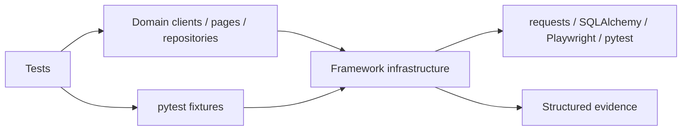

# Framework architecture

## Design objective

The framework separates **test intent** from **execution policy**. Tests describe behavior; infrastructure modules own configuration validation, transport policy, dependency lifecycle, persistence access, browser interaction boundaries, and diagnostic persistence.

The dependency direction is intentionally one-way:

Framework abstractions should model application concepts or cross-cutting policy. They should not mirror native pytest, requests, SQLAlchemy, or Playwright APIs without adding a real invariant.

## Configuration boundary

`TestSettings.from_env()` is the only process-environment parsing boundary for shared runtime settings. It produces immutable state and fails before network/browser/database side effects.

`TEST_BASE_URL` must:

- be an absolute HTTP(S) URL;
- contain a valid port when a port is present;
- not contain URL user-info/credentials;
- not contain a query string or fragment;
- preserve an optional path prefix.

Authentication belongs in controlled headers/cookies/secret injection, not URL user-info. Query parameters belong to individual requests, not the framework base URL.

Timeouts and retry counts are range-validated. Browser names are allowlisted. Boolean parsing is explicit rather than relying on Python truthiness.

## HTTP transport policy

`src/http_client.py` owns connection behavior:

- one `requests.Session` per client lifecycle;
- bounded connect and read timeouts;
- connection pooling;
- `X-Test-Run-Id` correlation;
- retries only for configured transient statuses and idempotent methods;
- deterministic session closure through context-manager semantics.

Mutating operations are not made reliable by blind retry. Domain-specific idempotency should be implemented only when the API exposes an idempotency contract.

## Deterministic dependency lifecycle

The local Flask dependency is started by a session-scoped fixture. Readiness uses bounded TCP polling instead of a startup sleep. Teardown requests normal process termination and escalates to kill only after the cleanup deadline.

Database tests use a session-scoped in-memory SQLite engine and short-lived SQLAlchemy sessions. Repository helpers own query semantics; tests own the records they assert.

These boundaries keep fast tests independent of DNS, public-service availability, fixed test order, and long-lived mutable process state.

## Browser model

Page objects/components own stable locators and feature-level interactions. Prefer role, label, accessible name, or stable test IDs. Playwright web-first assertions are the primary synchronization mechanism.

Fixed sleeps are prohibited as functional synchronization. If explicit polling is necessary, it must be bounded and tied to an observable condition.

Browser coverage is risk-based. Chromium is the primary CI gate; additional engines should be added where compatibility risk justifies the execution cost.

## Run-manifest lifecycle

`conftest.py` registers a small pytest plugin that builds `reports/run-manifest.json`.

The controller process owns the run-level artifact. With pytest-xdist, workers emit normal reports and the controller aggregates them; workers never write the shared manifest. CI explicitly exercises this topology with two xdist workers and verifies that a complete JSON manifest exists without temporary-file residue.

The manifest records one retained outcome per node ID, including:

- status and phase;
- bounded duration;
- worker identity when available;
- deterministic artifact key;
- run ID and non-secret runtime metadata;
- aggregate passed/failed/skipped counts.

When multiple phase reports exist, the most severe outcome is retained so teardown failures cannot be hidden behind a previously successful call phase.

## Diagnostic privacy

Diagnostics use an allowlist-oriented model. Runtime keys with secret-like names are redacted. Diagnostic URLs preserve only origin/path: user-info, query strings, and fragments are removed before persistence. This prevents common token-in-URL patterns from entering retained CI artifacts.

The run manifest is written to a temporary file and atomically renamed. An interrupted write therefore cannot leave a partial file at the final artifact path.

Browser screenshots/traces and page content may still contain application-visible test data. Use synthetic data and bounded artifact retention; automatic structured redaction is not a substitute for safe test-data design.

## Contract and schema ownership

Version-controlled contract artifacts live beside the tests that consume them. Schema/OpenAPI validation complements semantic assertions; it does not replace them. A response can satisfy shape and still be behaviorally incorrect.

## Parallelism rules

Parallel execution is the default assumption for fast layers. Shared state must be avoided or namespaced by run/worker identity. Tests requiring exclusive state should be isolated explicitly rather than disabling parallelism globally.

A framework helper is parallel-safe only when its lifecycle, filesystem writes, ports, and mutable data ownership remain deterministic under concurrent execution.

## Extension rules

New infrastructure should satisfy all of the following:

1. validate external input before side effects;
2. expose a narrow domain/policy boundary rather than a generic wrapper;
3. have a framework-contract test for its invariant;
4. define ownership and cleanup explicitly;
5. remain safe under parallel execution or document deliberate serialization;
6. emit bounded, privacy-aware diagnostics;
7. preserve the exit status of the underlying test failure.
