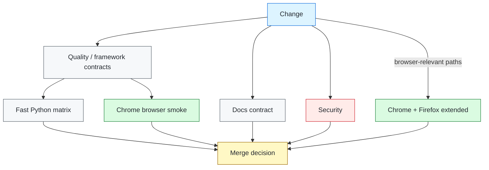

# Test Strategy

## Objective

The test strategy optimizes for trustworthy release signals, fast failure attribution, and controlled execution cost. Coverage is organized by risk and validation layer rather than by maximizing the number of browser tests.

A test belongs at the lowest layer that can conclusively prove the requirement.

## Validation layers

| Layer | Primary purpose | Typical dependencies | Pull-request policy |
| --- | --- | --- | --- |
| Unit | Pure logic and framework rules | Python process only | Always |
| API | HTTP behavior and error semantics | Local or approved service | Always for deterministic coverage |
| Contract | Version-controlled provider shape | OpenAPI/schema artifacts | Always |
| Persistence | Repository, transaction, mapping behavior | Deterministic database fixture | Always |
| Browser | Rendering, navigation, user interaction | Selenium + browser | Critical smoke workflow |
| Browser compatibility | Engine-specific behavior | Chrome + Firefox | Extended lane |
| Security | Repository risk or active security behavior | Trivy / approved ZAP target | Separate gate |
| Performance | Latency, throughput, saturation behavior | Locust + approved target | Explicit experiment |

## Fast gate

The fast gate excludes browser, performance, and active-security suites. It should remain suitable for every pull request and provide the earliest signal for framework regressions.

It verifies:

- unit behavior;
- API behavior;
- contract expectations;
- persistence behavior;
- configuration invariants;
- run-manifest ownership;
- pytest capability-selection contracts;
- supported Python versions;
- branch coverage.

Coverage percentage is a diagnostic guardrail rather than a substitute for risk analysis. New tests should prove meaningful behavior or framework policy, not simply exercise lines.

## Focused pytest execution

`--capability NAME` is a repeatable operator selector for narrowing an already collected suite. It is not a second test-selection language and it does not alter required CI coverage.

Focused execution must fail closed:

- capability markers remain native pytest markers and are registered for strict-marker mode;
- nonselected tests are skipped only after native collection;
- an unknown capability name is a usage error, not an all-skipped successful run;
- the terminal header exposes the active selection;
- CI remains responsible for the complete required suite rather than relying on ad hoc focused slices.

The false-green case to prevent is a misspelled selector that executes no intended test while returning success.

## Browser strategy

### What belongs in Selenium

Use browser automation when the requirement depends on a browser-specific surface:

- visible content and layout-dependent interaction;
- navigation;
- input behavior;
- browser storage or cookies when explicitly in scope;
- client-side application state;
- accessibility/user interaction paths that cannot be proven below the browser;
- supported-browser compatibility.

Do not move large data matrices, API validation, or database assertions into the browser solely because an end-to-end path exists.

### Deterministic committed workflow

The committed browser smoke test targets the repository-local Flask UI fixture. Its purpose is to verify framework behavior independently of third-party availability:

- Selenium driver construction;
- test-scoped isolation;
- explicit synchronization;
- stable page-object selectors;
- navigation;
- failure diagnostics;
- browser teardown.

Application adoption changes the target and domain page objects while keeping those infrastructure contracts.

### Browser matrix

Chrome is the standard pull-request browser. Chrome and Firefox run in the extended matrix.

The compatibility matrix should be driven by supported-user risk. Adding another browser is justified when the application support policy requires it and CI can provision it deterministically.

## Synchronization policy

Implicit waits remain disabled. Browser tests use explicit waits tied to observable conditions.

Preferred conditions include:

- visibility of a user-facing landmark;
- clickability of the intended control;
- expected URL/path change;
- application state that indicates asynchronous work completed.

Avoid:

- fixed `sleep()` calls;
- arbitrary retry loops around assertions;
- globally increasing timeouts without identifying the readiness condition;
- combining implicit and explicit waits.

A timeout should state which observable condition failed to arrive.

## Selector policy

Selectors should represent stable application contracts.

Preference order depends on the application, but generally favors:

1. accessible role/name when it is stable and meaningful;
2. dedicated stable test hook such as `data-testid`;
3. durable domain attributes;
4. structural CSS only when structure itself is the contract.

Avoid selectors coupled to incidental styling, generated classes, DOM position, or long descendant chains.

## Page-object policy

Page objects encapsulate interaction and synchronization, not business assertions.

A page object may:

- navigate to a configured target;
- locate stable controls;
- wait for readiness;
- perform a domain interaction;
- return visible state needed by the test.

A test should remain responsible for deciding whether the observed state satisfies the requirement.

## Retry policy

Retries are permitted only when the operation is safe to repeat and the failure has a known transient class.

### HTTP retries

The framework limits transport retries to safe/idempotent methods and explicit transient statuses. Mutating requests are not retried generically.

### Test retries

A test retry should not be the first response to flakiness. Before adding one, classify whether the cause is:

- synchronization;
- test-data collision;
- environment instability;
- eventual consistency with a measurable convergence condition;
- product nondeterminism;
- framework lifecycle defect.

Fix the cause where possible. A retry that hides an unknown failure mode weakens the release signal.

## Parallelism

Parallel execution is a correctness feature only after ownership is explicit.

The framework permits xdist for fast contracts while maintaining these invariants:

- workers do not write the shared run manifest;
- mutable state is isolated per test or worker;
- generated evidence uses collision-safe paths;
- browser sessions are independent;
- test order is not a prerequisite for correctness.

Tests requiring exclusive mutable infrastructure should be marked and scheduled deliberately rather than relying on incidental serial execution.

## Test data

Test data should be deterministic, minimal, and owned by the test scope that mutates it.

Prefer:

- factories/builders for generated values;
- version-controlled fixture data for deterministic contracts;
- unique run/test identifiers where shared environments require them;
- cleanup that is safe to repeat.

Supplied run IDs are bounded correlation tokens, not free-form labels. Unsafe whitespace/control characters and overlong values are rejected before they can become headers, artifact paths, or evidence keys.

Avoid production data, hidden dependencies on pre-existing records, and fixed globally shared mutable identifiers.

## API and contract testing

API tests should keep transport behavior visible. They should verify requirement-relevant status, headers, and body semantics without copying implementation details into tests.

Schema/contract checks are useful for structural expectations but do not replace behavioral assertions. A payload can satisfy a schema and still violate business semantics.

## Persistence testing

Persistence tests distinguish repository behavior from infrastructure availability.

Deterministic SQLite tests are appropriate for repository contracts that do not depend on provider-specific semantics. Provider-specific SQL, locking, isolation, migrations, or transaction behavior should be verified against the actual database technology in a dedicated integration lane.

## Security testing

Security signals are separated by purpose.

### Static/repository security

Trivy scans vulnerability, misconfiguration, and committed-secret surfaces in a dedicated workflow. Findings remain independently attributable from functional failures.

### Dynamic security

The committed OWASP ZAP test is restricted to loopback. External active scanning requires explicit authorization and should define:

- target scope;
- credentials;
- request rate;
- destructive-operation exclusions;
- data retention;
- finding threshold;
- ownership of remediation.

Active scanning must never be enabled by changing only an unconstrained environment variable.

## Performance testing

Locust experiments should answer a stated performance question. Every meaningful run should define:

- approved target;
- workload/user model;
- ramp pattern;
- duration;
- concurrency;
- service-level thresholds;
- environment capacity assumptions;
- result retention.

A short smoke load can prove script health. It cannot establish production capacity.

## Evidence and privacy

Evidence should be sufficient to classify a failure without collecting unnecessary application data.

The generic browser collector keeps a bounded envelope and deliberately excludes cookies, browser storage, page source, response bodies, URL credentials, queries, and fragments. Screenshots are failure-only.

Before adding richer evidence, decide:

- whether it may contain credentials or personal/customer data;
- who can access artifacts;
- how long artifacts are retained;
- whether redaction is reliable;
- whether the evidence is actually needed for diagnosis.

## CI gating

Required checks should fail for their own domain and preserve the original command exit code. Reporting/upload steps may run after failures but must not convert a failing gate into success.

## Definition of a trustworthy test

A test is ready to act as a gate when:

- the requirement being proved is clear;
- the layer is appropriate for that requirement;
- setup and cleanup ownership are deterministic;
- environment assumptions are validated;
- synchronization is based on observable state;
- retries, if any, are justified by a classified transient condition;
- execution order is irrelevant unless explicitly declared;
- evidence is safe and sufficient;
- a failure points toward a specific product, framework, or environment boundary.

The value of a suite is determined by the quality of its signal, not by its raw test count.
